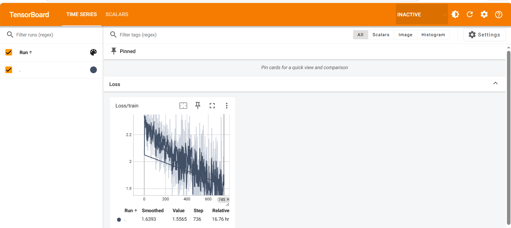
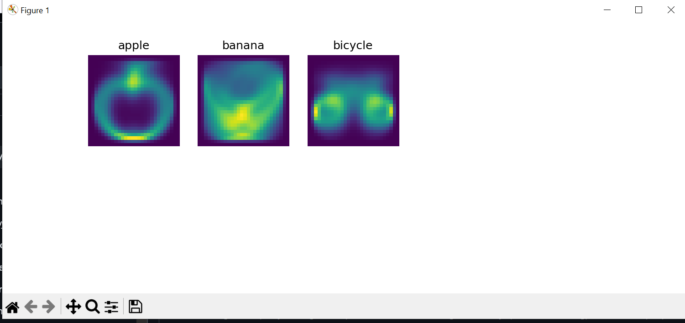

# Deep-Learning-For-Computer-Vision

Dự án này bao gồm một loạt các bài tập và nghiên cứu về Học Máy và Học Sâu, từ các khái niệm cơ bản đến các kỹ thuật phức tạp hơn. Mỗi bài tập sẽ đi sâu vào các chủ đề và công cụ phổ biến trong lĩnh vực học máy.

## Mục Lục
- [EX2 - Phân tích sâu sự khác nhau giữa Machine Learning và Deep Learning](#ex2)
- [EX3 - Linear Classifier](#ex3)
- [EX4 - From Linear Classifier to Neuron & Activation Function](#ex4)
- [EX5 - Neural Network và Forward Propagation](#ex5)
- [EX6 - Loss Function](#ex6)
- [EX7 - Gradient và Optimization](#ex7)
- [EX8 - Backpropagation](#ex8)
- [EX9 - Parameters vs Hyperparameters](#ex9)
- [EX10 - Image Representation và Data Preprocessing](#ex10)
- [EX11 - PyTorch Tensor, Image-to-Tensor, Dataset và Training Pipeline](#ex11)
- [EX12 - Convolutional Neural Network (CNN)](#ex12)
- [EX13 - Receptive Field, Dilated Convolution và Common CNN Layer Pattern](#ex13)
- [EX14 - Training Stability trong Deep Learning](#ex14)
- [EX15 - ImageNet, Transfer Learning và Data Augmentation](#ex15)

---

# Animal Dataset Classification

Dự án này là một phần của khóa học học sâu, với mục tiêu giải quyết bài toán phân loại hình ảnh động vật từ dataset `animal_dataset.py`. Các bài toán chính sẽ được giải quyết qua việc huấn luyện và tối ưu hóa các mô hình **Simple Neural Network** và **Simple CNN**, hai mô hình học sâu cơ bản trong việc phân loại hình ảnh.

## Các Bài Toán Giải Quyết trong Khóa Học

### 1. **Phân loại Hình Ảnh Động Vật (Animal Image Classification)**
   - **Vấn đề**: Dự án này giải quyết bài toán phân loại hình ảnh động vật từ dataset chứa các hình ảnh của nhiều loài động vật khác nhau.
   - **Mô hình giải quyết**: 
     - **Simple Neural Network (SimpleNN)**: Mô hình mạng nơ-ron đơn giản, phù hợp cho các bài toán phân loại cơ bản.
     - **Simple CNN (Convolutional Neural Network)**: Mô hình CNN mạnh mẽ hơn, giúp mô hình học các đặc trưng phức tạp trong hình ảnh động vật, với các lớp **convolution**, **pooling**, và **fully connected**.
   - **Chức năng**: Dự án giúp phân loại chính xác các loài động vật thông qua việc huấn luyện mô hình trên dataset hình ảnh.

### 2. **Tiền Xử Lý Dữ Liệu (Data Preprocessing)**
   - **Vấn đề**: Dữ liệu hình ảnh động vật có thể không đồng nhất và cần được tiền xử lý để phù hợp với mô hình học sâu.
   - **Mô hình giải quyết**: 
     - **Dataloader**: Sử dụng các công cụ như `dataloader_cifar.py` và `dataset_cifar.py` để chuẩn bị dữ liệu, bao gồm chia dữ liệu thành các tập huấn luyện và kiểm tra, chuẩn hóa ảnh, và chuyển đổi ảnh thành Tensor.
   - **Chức năng**: Đảm bảo dữ liệu đầu vào sẵn sàng cho quá trình huấn luyện và kiểm tra.

### 3. **Huấn Luyện Mô Hình (Model Training)**
   - **Vấn đề**: Sau khi chuẩn bị dữ liệu, mô hình cần được huấn luyện để học các đặc trưng từ ảnh động vật.
   - **Mô hình giải quyết**: 
     - **Simple Neural Network**: Được huấn luyện qua thuật toán **gradient descent** và hàm mất mát **cross-entropy**.
     - **Simple CNN**: Mô hình CNN được huấn luyện qua các bước tương tự, nhưng sẽ sử dụng các lớp convolution để học các đặc trưng của hình ảnh động vật.
   - **Chức năng**: Cải thiện độ chính xác phân loại hình ảnh thông qua việc tối ưu hóa các trọng số của mô hình.

### 4. **Đánh Giá Độ Chính Xác Mô Hình (Model Evaluation)**
   - **Vấn đề**: Sau khi huấn luyện, mô hình cần được kiểm tra để đánh giá độ chính xác và khả năng phân loại.
   - **Mô hình giải quyết**: 
     - **Test Script**: Sử dụng **test.py** để kiểm tra mô hình trên tập kiểm tra và tính toán các chỉ số như **accuracy**, **precision**, và **recall**.
   - **Chức năng**: Đánh giá mức độ chính xác của mô hình và giúp cải thiện các tham số nếu cần.

---

## Các Thành Phần Chính

### 1. **Animal Dataset**
   - **Vấn đề**: Cung cấp bộ dữ liệu động vật đa dạng và phong phú để huấn luyện mô hình phân loại.
   - **Giải pháp**: Dữ liệu động vật được cung cấp trong `animal_dataset.py`. Dataset này bao gồm hình ảnh của nhiều loài động vật khác nhau.
   - **Các Tệp Liên Quan**: `dataloader_cifar.py` và `dataset_cifar.py` giúp tải và chuẩn bị dữ liệu cho mô hình.

### 2. **Mô Hình**
   - **Simple Neural Network**: Một mô hình mạng nơ-ron đơn giản, thích hợp cho các bài toán phân loại cơ bản.
   - **Simple CNN**: Mô hình CNN mạnh mẽ, giúp nhận diện các đặc trưng trong hình ảnh động vật.

### 3. **Quy Trình Huấn Luyện và Kiểm Tra**
   - **Huấn luyện**: `train.py` sử dụng các thuật toán học sâu để huấn luyện mô hình với dữ liệu động vật.
   - **Kiểm tra**: `test.py` thực hiện kiểm tra và đánh giá độ chính xác của mô hình.

---

## Ví Dụ Hình Ảnh

### Loss Graph - Training Process

Dưới đây là ví dụ về biểu đồ **loss** trong quá trình huấn luyện, giúp theo dõi sự thay đổi của **loss** theo từng bước huấn luyện.



### Kết Quả Đầu Ra của Mô Hình

Hình ảnh dưới đây thể hiện mô hình sau khi huấn luyện đã phân loại đúng các hình ảnh trong bộ dữ liệu.



---

## Visual Simulation for Linear Classifier

Đoạn mã dưới đây mô phỏng quá trình dự đoán cho các hình ảnh từ bộ dữ liệu **full_numpy_bitmap_apple.npy**, **full_numpy_bitmap_banana.npy**, **full_numpy_bitmap_bicycle.npy**. Mô hình **SimpleCNN** sẽ dự đoán và hiển thị kết quả cho các hình ảnh đầu vào.

### Các Bước:
1. **Tiền xử lý hình ảnh**: Hình ảnh được tải về từ thư mục **quick raw data**, chuyển thành tensor và chuẩn hóa.
2. **Dự đoán**: Mô hình **SimpleCNN** dự đoán cho mỗi hình ảnh và trả về kết quả.
3. **Hiển thị kết quả**: Mỗi hình ảnh đầu vào được hiển thị cùng với tên lớp dự đoán.

### Ví Dụ Hình Ảnh:

Dưới đây là ví dụ về kết quả dự đoán cho các hình ảnh đồ vật:


---

### Các Ghi Chú

- **Loss Graph**: Biểu đồ **loss** theo dõi quá trình huấn luyện mô hình. Nếu **loss** giảm dần, mô hình đang học tốt. Nếu không, cần điều chỉnh tham số như **learning rate**.
- **Model Output**: Các hình ảnh này thể hiện độ chính xác của mô hình trên bộ dữ liệu kiểm tra.

---

Hy vọng rằng bản điều chỉnh này sẽ giúp bạn hiểu rõ hơn về các bài toán mà khóa học giải quyết. Nếu bạn muốn thêm bất kỳ chi tiết nào hoặc có yêu cầu chỉnh sửa, đừng ngần ngại yêu cầu tôi!

## EX2 - Phân tích sâu sự khác nhau giữa Machine Learning và Deep Learning

Trong bài tập này, chúng ta sẽ phân tích sự khác nhau giữa Học Máy (Machine Learning) và Học Sâu (Deep Learning). Mặc dù cả hai đều là các kỹ thuật học tự động, nhưng Học Sâu có thể tự động học từ dữ liệu mà không cần sự can thiệp của con người trong việc chọn đặc trưng, trong khi Học Máy yêu cầu một số công đoạn chuẩn bị dữ liệu trước.

**Các điểm chính**:
- **Machine Learning**: Dựa trên các mô hình có thể học từ dữ liệu có cấu trúc, chẳng hạn như hồi quy và phân loại.
- **Deep Learning**: Một nhánh con của Machine Learning sử dụng các mạng nơ-ron sâu để học các đặc trưng phức tạp từ dữ liệu không có cấu trúc, ví dụ như hình ảnh và âm thanh.

---

## EX3 - Linear Classifier

Linear Classifier là một trong những thuật toán đơn giản nhất trong học máy, sử dụng một siêu phẳng (hyperplane) để phân loại dữ liệu thành các nhóm khác nhau. Mục tiêu của bài tập này là hiểu rõ cách hoạt động của phân loại tuyến tính và áp dụng nó vào một ví dụ cụ thể.

**Các điểm chính**:
- Mô hình này được định nghĩa thông qua phương trình tuyến tính: \( y = w^T x + b \)
- Ứng dụng trong phân loại nhị phân và đa lớp.

---

## EX4 - From Linear Classifier to Neuron & Activation Function

Bài tập này đi từ phân loại tuyến tính và giải thích cách chuyển đổi nó thành một mạng nơ-ron đơn giản với hàm kích hoạt. Các nơ-ron trong mạng sẽ áp dụng các hàm kích hoạt như sigmoid, ReLU, và tanh để học các đặc trưng phi tuyến tính.

**Các điểm chính**:
- Chuyển từ mô hình tuyến tính sang nơ-ron.
- Giới thiệu các hàm kích hoạt như sigmoid và ReLU.

---

## EX5 - Neural Network và Forward Propagation

Mạng nơ-ron là một tập hợp các nơ-ron kết nối với nhau để học và đưa ra quyết định. Trong bài tập này, chúng ta sẽ tìm hiểu về cơ chế Forward Propagation, nơi dữ liệu được đưa qua mạng từ lớp đầu vào đến lớp đầu ra.

**Các điểm chính**:
- Forward Propagation là quá trình tính toán đầu ra của mạng nơ-ron.
- Sử dụng trọng số và hàm kích hoạt để tính toán các giá trị đầu ra.

---

## EX6 - Loss Function

Loss Function (hàm mất mát) là một phần quan trọng trong huấn luyện mạng nơ-ron. Nó giúp xác định mức độ sai lệch giữa giá trị dự đoán và giá trị thực tế.

**Các điểm chính**:
- Các loại hàm mất mát phổ biến: MSE (Mean Squared Error), Cross-Entropy.
- Cách tính toán và áp dụng hàm mất mát trong quá trình huấn luyện.

---

## EX7 - Gradient và Optimization

Gradient Descent là thuật toán tối ưu quan trọng trong học sâu. Bài tập này sẽ giải thích cách sử dụng gradient để tìm ra trọng số tối ưu cho mô hình.

**Các điểm chính**:
- Gradient Descent là phương pháp tối ưu hóa sử dụng đạo hàm để cập nhật trọng số.
- Các biến thể của Gradient Descent: Stochastic, Batch, và Mini-batch.

---

## EX8 - Backpropagation

Backpropagation là thuật toán được sử dụng để cập nhật trọng số trong mạng nơ-ron thông qua việc tính toán gradient của hàm mất mát đối với từng trọng số.

**Các điểm chính**:
- Quá trình truyền ngược và cách sử dụng đạo hàm để tối ưu mô hình.
- Cách thức hoạt động của backpropagation trong việc giảm thiểu hàm mất mát.

---

## EX9 - Parameters vs Hyperparameters

Bài tập này phân biệt giữa tham số (parameters) và siêu tham số (hyperparameters) trong học sâu. Các tham số được học từ dữ liệu trong khi siêu tham số được xác định trước khi huấn luyện mô hình.

**Các điểm chính**:
- **Parameters**: Trọng số và độ lệch trong mô hình.
- **Hyperparameters**: Các tham số như learning rate, số lớp, số lượng nơ-ron trong mỗi lớp.

---

## EX10 - Image Representation và Data Preprocessing

Bài tập này giải thích cách biểu diễn hình ảnh trong học sâu và tầm quan trọng của tiền xử lý dữ liệu, như thay đổi kích thước và chuẩn hóa, trong việc huấn luyện mô hình.

**Các điểm chính**:
- Các phương pháp biểu diễn hình ảnh như vector hóa và ma trận.
- Tiền xử lý dữ liệu: chuẩn hóa, thay đổi kích thước, phân chia tập dữ liệu.

---

## EX11 - PyTorch Tensor, Image-to-Tensor, Dataset và Training Pipeline

Trong bài tập này, chúng ta sẽ tìm hiểu về PyTorch Tensor, cách chuyển đổi hình ảnh thành Tensor, cách tạo Dataset và thiết lập Pipeline huấn luyện cho mạng nơ-ron.

**Các điểm chính**:
- Tạo và thao tác với PyTorch Tensors.
- Tạo dataset và sử dụng DataLoader để huấn luyện mô hình.

---

## EX12 - Convolutional Neural Network (CNN)

Convolutional Neural Networks (CNN) là một trong những loại mạng nơ-ron mạnh mẽ nhất trong xử lý hình ảnh. Bài tập này sẽ giới thiệu kiến trúc CNN và cách sử dụng nó trong việc phân loại hình ảnh.

**Các điểm chính**:
- Các lớp cơ bản trong CNN: Convolution, Pooling, Fully Connected.
- Các ứng dụng của CNN trong nhận dạng hình ảnh.

---

## EX13 - Receptive Field, Dilated Convolution và Common CNN Layer Pattern

Bài tập này sẽ giải thích khái niệm về receptive field và dilated convolution trong CNN. Ngoài ra, chúng ta cũng sẽ khám phá các mẫu lớp phổ biến trong kiến trúc CNN.

**Các điểm chính**:
- Receptive Field: Kích thước khu vực hình ảnh mà mỗi nơ-ron trong lớp convolution có thể nhận diện.
- Dilated Convolution: Kỹ thuật mở rộng phạm vi tiếp nhận mà không cần tăng số lượng tham số.

---

## EX14 - Training Stability trong Deep Learning

Bài tập này đề cập đến các yếu tố ảnh hưởng đến sự ổn định trong quá trình huấn luyện mô hình deep learning, bao gồm lựa chọn hàm mất mát, tối ưu hóa và điều chỉnh siêu tham số.

**Các điểm chính**:
- Các yếu tố ảnh hưởng đến sự ổn định trong học sâu.
- Các kỹ thuật giúp cải thiện sự ổn định như Batch Normalization và Gradient Clipping.

---

## EX15 - ImageNet, Transfer Learning và Data Augmentation

Bài tập này sẽ giới thiệu về ImageNet và cách sử dụng Transfer Learning để cải thiện hiệu suất mô hình. Đồng thời, chúng ta sẽ tìm hiểu về kỹ thuật Data Augmentation trong việc mở rộng bộ dữ liệu huấn luyện.

**Các điểm chính**:
- ImageNet: Datasets lớn dùng trong huấn luyện mô hình học sâu.
- Transfer Learning: Sử dụng mô hình đã huấn luyện trước để giải quyết vấn đề mới.
- Data Augmentation: Tăng cường dữ liệu bằng cách biến đổi hình ảnh.

---

## Cách sử dụng

1. Clone repo về máy:
   ```bash
   git clone https://github.com/username/project-name.git
